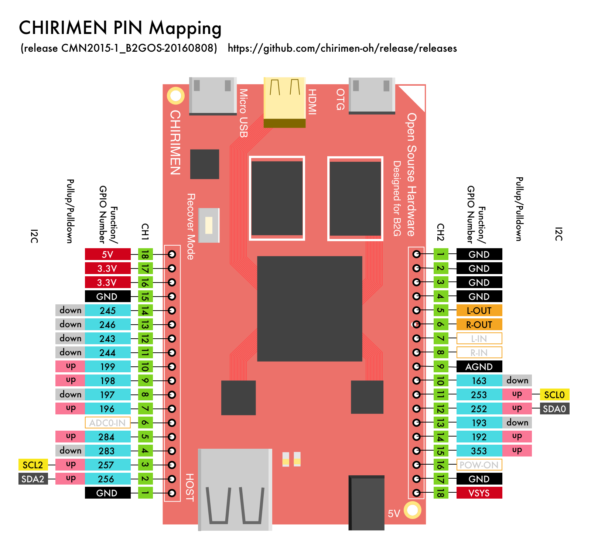

# chirimen-expr

[CHIRIMEN (Echigo Rev.1)](https://www.switch-science.com/catalog/2833/) 実験用の野良設計ライブラリです。

こちらは @tadfmac が勝手に作成した非公式のものです。
CHIRIMENに関する公式情報は下記を参照ください。

- [CHIRIMEN Open Hardware 公式Webサイト](https://chirimen.org/)
- [CHIRIMEN Open Hardware プロジェクト リポジトリ](https://github.com/chirimen-oh/)

# 免責事項

本リポジトリに掲載する情報を利用することで発生したトラブルや損失、損害に対して、本リポジトリ管理人(D.F.Mac. @TripArts Music)や、CHIRIMENコミュニティは一切責任を負いません。ご利用は利用者の責任において行ってください。

# CHIRIMENのピンアサイン

Web APIから利用可能な機能にフォーカスしたGPIOマップです。

### Licence

 GPIO配置図は<a rel="license" href="http://creativecommons.org/licenses/by/4.0/">クリエイティブ・コモンズ 表示 4.0 国際 ライセンスの下に提供されています。</a>

# Library for EAGLE

CHIRIMEN用のEAGLEライブラリです。
オリジナルシールド等の作成にお役立てください。
EAGLE v7.6用です。

[chirimen.lbr](./0-chirimen.lbr)

### Licence

 chirimen.lbrは<a rel="license" href="http://creativecommons.org/licenses/by/4.0/">クリエイティブ・コモンズ 表示 4.0 国際 ライセンスの下に提供されています。</a>

# 野良バイナリ

実験用のバイナリです。現在主にi2c機能の拡張を実験中です。
十分動作確認できたら、本家([githubリポジトリ](https://github.com/chirimen-oh/gecko-dev))にプルリクする際にソースコードも含めて登録予定です。
実験終了、本家マージまでの一時的な期間限定で公開します。

## CHRMN-dfm20170103 (2017/01/03更新)

CHRMN-dfm20170103 は、[CMN2015-1_B2GOS-20160808](https://github.com/chirimen-oh/release/releases)をベースに、下記修正を加えたものです。

- [gecko Last Commit (9e91fe4) の反映](https://github.com/chirimen-oh/gecko-dev) 
- I2CManager.open,SetDeviceAddress,Write,Read等でエラー発生時にDOMExceptionを発生させるよう修正

[CHRMN-dfm20170103.img (ダウンロード)](http://chrmn.dfm.lrv.jp/img/CHRMN-dfm20170103.img.zip)

## CHRMN-dfm20170104 (2017/01/04更新)

CHRMN-dfm20170104 は、CHRMN-dfm20170103をベースに下記修正を加えたものです。

- I2CManager.Write,ReadにaDeviceAddressパラメータを追加。
- I2CService.Write,ReadのパラメータにもaDeviceAddressを追加。これらのAPI呼び出し時にI2CServiceが最後に利用したSlaveAddressと指定されたaDeviceAddressが異なる場合、SetDeviceAddressを実行してからWrite,Readを実施するように修正

I2CManagerのNative側実装のAPIパラメータを追加しているため、本バージョンを利用するには併せてPolyfill側の修正も必要です。

[CHRMN-dfm20170104.img (ダウンロード)](http://chrmn.dfm.lrv.jp/img/CHRMN-dfm20170104.img.zip)

### Licence

本バイナリは「[chirimen-oh](https://github.com/chirimen-oh)」で公開されているソフトウエアに改変を加え生成したものです。

ライセンスについても、[chirimen-oh](https://github.com/chirimen-oh/release/blob/master/LICENSE)に準じます。

